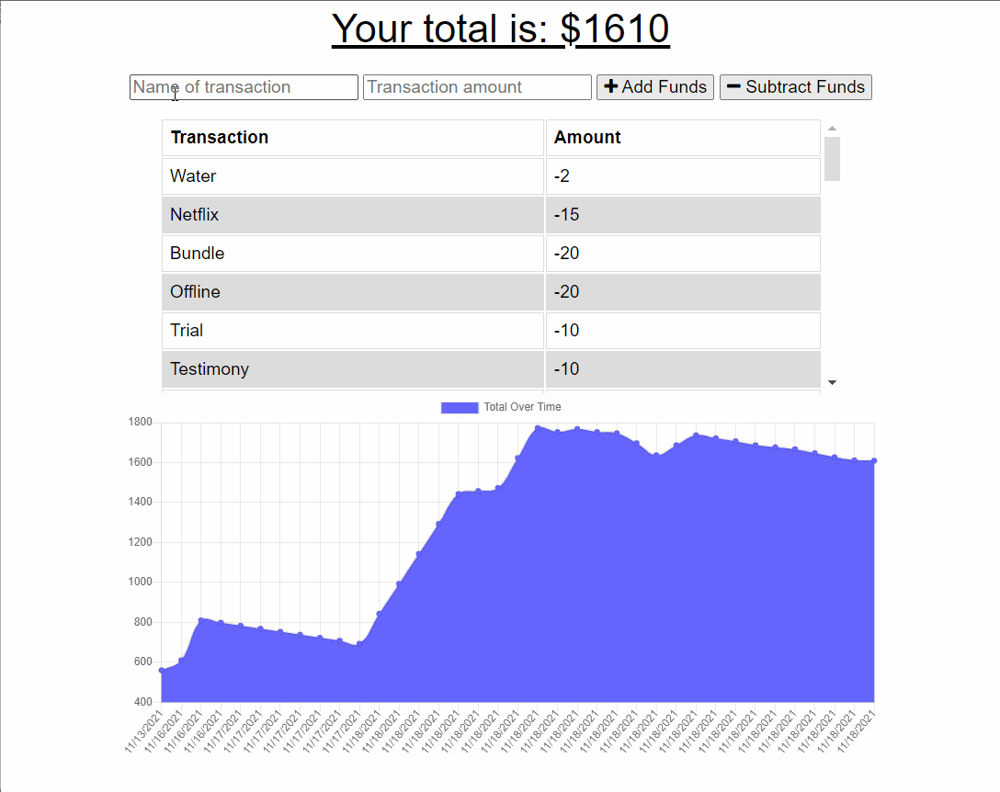

# offline-budget-tracker

## Author
Alonzo Roman

## Table of Contents
* [Summary](#Summary)
* [Deployed Link](#Deployed-Link)
* [Screen Record](#Screen-Record)
* [Code](#Code-Snippet)
* [Technologies](#Technologies)
* [Contact](#Contact-Links)

## Summary
The purpose of this project is to create an application that users can use to update their budget, wether they are online or offline through the utilization of PWAs, or progressive web applications. The use of a service-worker and a manifest are used in order to maintain app functionality while offline. 

## Deployed Link
- [Link](https://immense-citadel-49133.herokuapp.com/)

## Screen Record


## Code Snippet
In order to store data that had been submitted while offline into the site when back online, the use of an indexedDB was used. Data is stored in the database, then when the database is checked, which is upon page load while online, the information that is in the database is posted.

```Javascript
function checkDatabase() {
    const transaction = db.transaction(['pending'], 'readwrite');
    const store = transaction.objectStore('pending');
    const getAll = store.getAll();

    getAll.onsuccess = function () {
        if (getAll.result.length > 0) {
            fetch('api/transaction/bulk', {
                method: 'POST',
                body: JSON.stringify(getAll.result),
                headers: {
                    Accept: 'application/json, text/plain, */*',
                    'Content-Type': 'application/json'
                }
            }).then(response => response.json()).then(() => {
                const transaction = db.transaction(['pending'], 'readwrite');
                const store = transaction.objectStore('pending');
                store.clear();
            });
        }}};
```

## Technologies

- [Javascript](https://developer.mozilla.org/en-US/docs/Web/JavaScript)
- [Node.js](https://nodejs.org/en/docs/)
- [Express](https://expressjs.com/)
- [MongoDB](https://www.mongodb.com/)
- [Morgan](https://www.npmjs.com/package/morgan)
- [PWA](https://developer.mozilla.org/en-US/docs/Web/Progressive_web_apps)

## Contact Links

- [Github](https://github.com/alonzofroman)
- [LinkedIn](https://www.linkedin.com/in/alonzo-roman/")

## Resources/Acknowledgements 

- [W3Schools](https://www.w3schools.com/)
- [MDN Web Docs](https://developer.mozilla.org/en-US/)
